## Run multiple commands in one line with ; (semi colon)
```    
# ls ; pwd; date; uptime
(here if any of command fails, since its a kind of unconditional execution so it will not stop the execution of next command)
    
# ls ; pwwd ; date; uptime 
(here, pwwd is a type and no such command so, it will give the result as error and then run the next command)
```
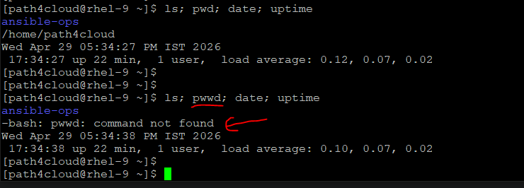

## Run multiple commands in one line with && (Logical AND)
- It's  a conditional command and second command will be executed only when first command will be executed successfully.
```
# pwd && date
(since both command fine, both will be executed)

# pwwd && date
(first command is wrong, so give error and exit, second command will not be executed)

# pwd && datet
(first command is fine, so both will be executed but second command is typo so give error)
```    
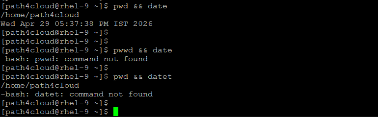

## Run mulitple commands in one line with || (Logical OR)
- If a command before double pipe(||) fails, only then the second command will be executed
```
# pwd || date
(here pwd works, so date will not be executed)

# pwdd || date
(here, pwdd is typo, not a real command, then date will be executed)
```
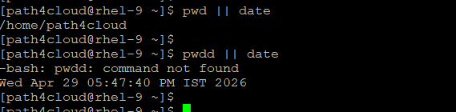

## Another helpful shotcuts for bash shell
- We can use ^ symbol to replace the any matching string in very last command executed.
- We can use !! to repart the last command wihout typing whole command
- We can use !(number) of the command listed in history to execute again # !15 (will run the command number 15 from history)
- We can use !(command_executed) to run the command from history which matches first command from history from below) # !ls (if previously ls command exectuted, it will run the same command) 
- `head` command helps to display the first 10 lines from a file.
- `tail` command helps to display the last 10 lines from a file.
- `wc` will list the number of lines, words and characters from a file. # wc /etc/hosts (-l for line, -c for character, -w for words)
- use listeral backslash (\) at the end of line if you want to continue with same line on cli or in documents, bash will consider that as a single line only.

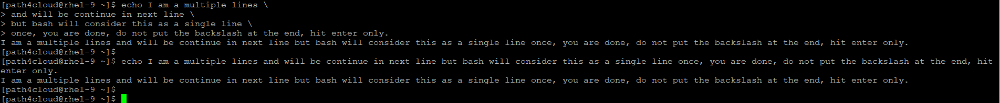

```
[path4cloud@rhel-9 ~]$ systemctl status firewalld
....output.....
[path4cloud@rhel-9 ~]$ ^status^restart
systemctl restart sshd
(here, ^status get replaced with ^restart and same command executed again)
(since it a admin command so will prompt for root password, we can pass the credentails or run sudo !! to repeat the command)

[path4cloud@rhel-9 ~]$ sudo !!
sudo systemctl restart sshd
[sudo] password for path4cloud:
```
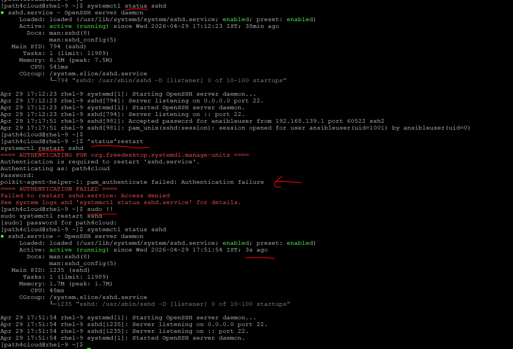

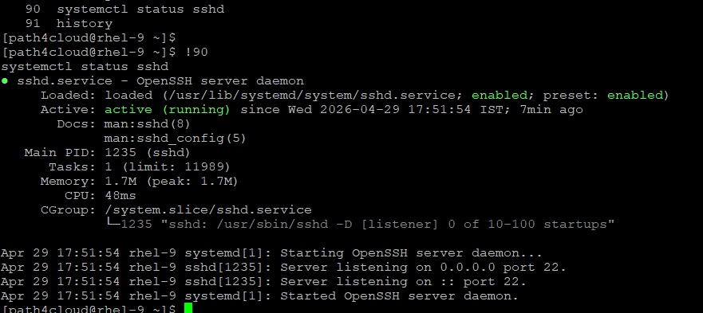

## date command has many formats
```
# [path4cloud@rhel-9 ~]$ date +%R
18:01
(24-hour hour and minute; same as %H:%M)

[path4cloud@rhel-9 ~]$ date +%F
2026-04-29
(full date; like %+4Y-%m-%d)

[path4cloud@rhel-9 ~]$ date +%A
Wednesday
(locale's full weekday name (e.g., Sunday)

[path4cloud@rhel-9 ~]$ date --help
(for more help and options)
```

## File command helps you to get the type of file
```
[path4cloud@rhel-9 ~]$ file ansible-ops/
ansible-ops/: directory

[path4cloud@rhel-9 ~]$ file ansible-ops/ansible.cfg.bkp
ansible-ops/ansible.cfg.bkp: ASCII text

[path4cloud@rhel-9 ~]$ file /usr/bin/ls
/usr/bin/ls: ELF 64-bit LSB pie executable, x86-64, version 1 (SYSV), dynamically linked, interpreter /lib64/ld-linux-x86-64.so.2, BuildID[sha1]=3ccc0d8aa8dc371f9c762c6e76823aa5b9d4041b, for GNU/Linux 3.2.0, stripped

[path4cloud@rhel-9 ~]$ file ping.sh
ping.sh: Bourne-Again shell script, ASCII text executable
```

## TAB completion command
```
# tail pas<tab><tab>
(it will list all files starting with pas if any, if only one file then it will complete the file name)
```

## Globbing 
- It is the process where the shell uses special "wildcard" characters to find and expand filenames that match a specific pattern.
- How to use it, lets try to run `ls` command to play with Globbing
---
    - Asterisk (*) Matches zero or more characters
    - example: # ls *.txt (will list all files ending with .txt), ls `*ansible*` lists any file with "ansible" anywhere in the name. 
---
    - ? (Question Mark): Matches exactly one character
    - example: # ls 0?-* (here, after 0, it looks for any single character and then - and post dash, any number of character. All files will be listed which matches with this pattern)
    - similar case with ?? (looking for two chracter), ??? (looking for three character)
---
    - [ ] (Square Brackets): Matches any single character from the list inside
    - ls 0[1-3]* — Matches files starting with 01, 02, or 03
    - ls [[:digit:]]* — Matches any file starting with a number

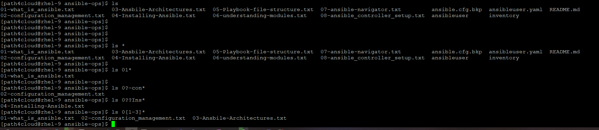

## heredoc file
```
We can redirect the input with cat > command to a file using heredoc. 
Syntax is :
[path4cloud@rhel-9 ~]$ cat > my_heredoc.txt << EOF
> This is the first line and you can hit enter to continue to write.
> another line
> hit enter
> hit enter
> if you want to create the file and safely save and exit then write EOF in last line
> EOF
[path4cloud@rhel-9 ~]$
[path4cloud@rhel-9 ~]$ # you can cat the file to display the content.
```
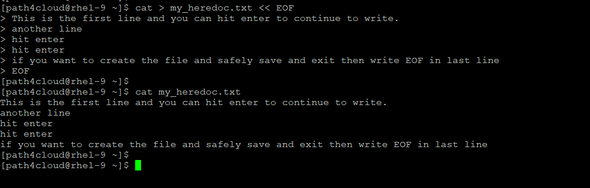

## One more way to create the file with cat command
```
[path4cloud@rhel-9 ~]$ cat > my_file.txt
type your data and contine to hit enter
until you finish
more data
one more line
once you done with your data then hit one last enter and the press ctrl+D to save and exit from file

[path4cloud@rhel-9 ~]$
```
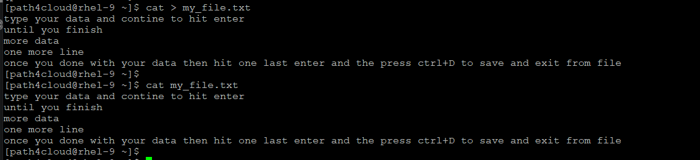

## Brace Expansion
It is a mechanism by which the shell generates arbitrary strings. In your specific command.

Common Use Cases:
- Creating directory structures: mkdir -p project/{src,bin,lib,docs}
- Creating ranges: touch file{1..10}.txt (creates file1.txt through file10.txt)
- Quick backups: cp long_filename.conf{,.bak} (expands to cp long_filename.conf long_filename.conf.bak)
- Multiple extensions: rm *.{log,tmp,swp}
```
[path4cloud@rhel-9 ~]$ mkdir -p project/{src,bin,lib,docs}
[path4cloud@rhel-9 ~]$ touch file{1..10}.txt
[path4cloud@rhel-9 ~]$ cp ping.sh{,.bkp}
[path4cloud@rhel-9 ~]$ rm *.{txt,bkp}
[path4cloud@rhel-9 ~]$ cp ping.sh{,.$(date +%F)}
```

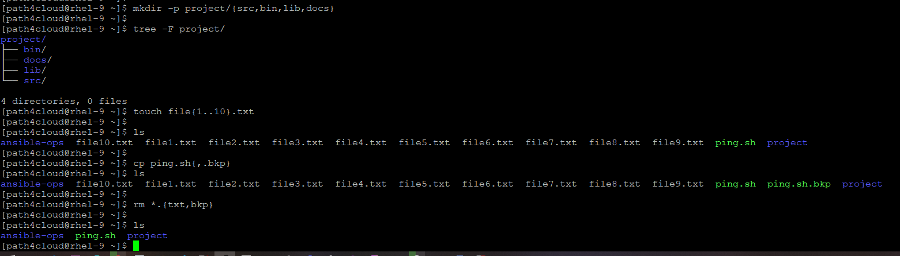

## manual help (man pages)
- mostly we used man 1, man 5 and man 8 are frequently used for manual pages.
```
[path4cloud@rhel-9 etc]$ man -k crontab
anacrontab (5)       - configuration file for Anacron
crontab (1)          - maintains crontab files for individual users
crontab (5)          - files used to schedule the execution of programs
crontabs (4)         - configuration and scripts for running periodical jobs
```

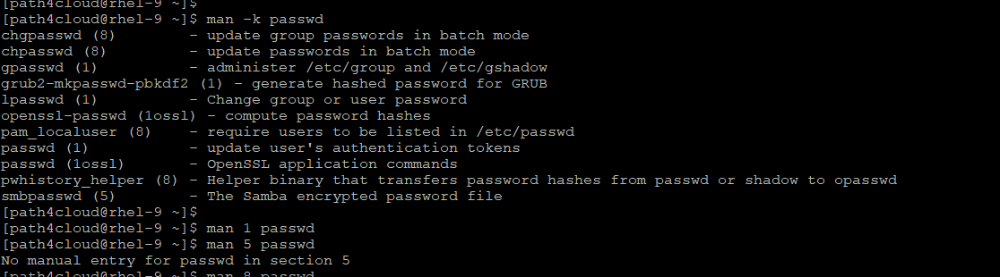


## Input/Output redirection
```
[path4cloud@rhel-9 ~]$ cat /etc/hosts > hostinfo
(redirecct the output to hosstinfo file, nothing will be displayed on screen)

[path4cloud@rhel-9 ~]$ cat /etc/hosts >> hostinfo
(redirect the ouput and append under thhe existing content)

[path4cloud@rhel-9 ~]$ cat /etc/hosss 2> hostinfo
(here, we have typo so error will be redirected to hostinfo)

[path4cloud@rhel-9 ~]$ cat /etc/hostss > hostinfo 2>&1
(here any error or output will be redirected to hostinfo)

[path4cloud@rhel-9 ~]$ find / -size +50M &> output_error.txt
(here, we are sending both standard output and stanard input into txt file using &> which captures the both)

[path4cloud@rhel-9 ~]$ cat /etc/resolv.conf | tee dnsinfo
(here, tee will take output from cat command and store it in dnsinfo file and display the same standart output on screen)

[path4cloud@rhel-9 ~]$ ip r | tee -a dnsinfo
(by default, tee command overwrite the content but if we use -a option then it will append the content under the existing content in the file)
```


