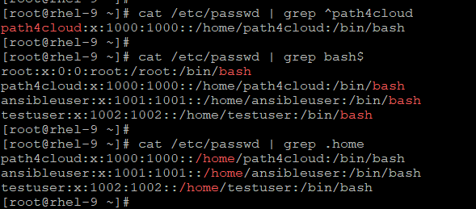
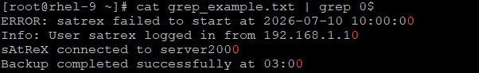
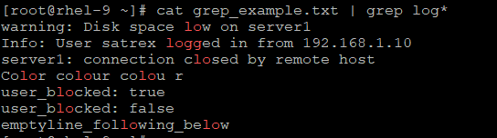
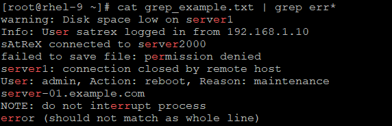
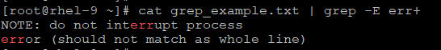
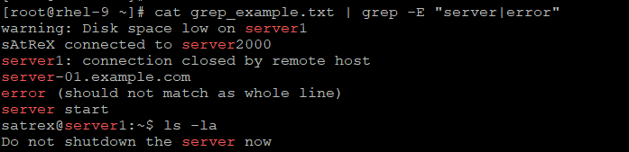
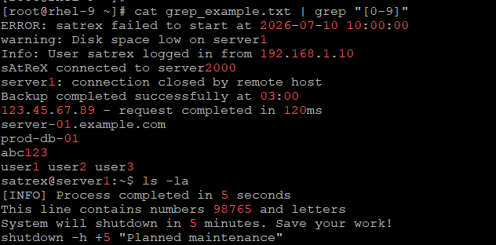

## Regular Expression with grep

dot (.): Matches any single character

caret (^): Matches start of a line

dollar ($): Matches end of a line
```
# cat /etc/passwd | grep ^path4cloud
(here, it will print the line which start with 'path4cloud' string)

# cat /etc/passwd | grep bash$
(here, it will print the line which ends with 'bash' string)

# cat /etc/passwd | grep .home
(here, it will print all line where 'home' string is there))
```


## Some more basic pattern

| Pattern | Meaning | Example |
| --- | --- | --- |
| . | Any single character | grep "s.trex" file (matches satrex, setrex, etc.) |
| ^ | Start of line | grep "^error" file |
| $ | End of line | grep "failed$" file |
| * | Zero or more of previous character | grep "a*" file |
| \\+ | One or more (needs -E) | grep -E "error+" file |
| ? | Zero or one (needs -E) | grep -E "colou?r" file |
| \| | OR condition (needs -E) | grep -E "error\|warning" file |
| [] | Match any character inside | grep "[0-9]" file |
| [^] | Negate character class | grep "[^0-9]" file |
| \\b or \\< | Word boundary | grep "\\bserver\\b" file |

## Lets run some example

[grep_example.txt](./lab_images/grep_example.txt)

```
# cat grep_example.txt | grep .ac

# cat grep_example.txt | grep ^server

# cat grep_example.txt | grep 0$

# cat grep_example.txt | grep log*

# cat grep_example.txt | grep -E err+

# cat grep_example.txt | grep -iE "colou?r"
Color colour colou r colouar

# cat grep_example.txt | grep -E "server|error"

# cat grep_example.txt | grep "[0-9]"

# cat grep_example.txt | grep "[^0-9]"

# cat grep_example.txt | grep -inw "server"
OR
# cat grep_example.txt | grep "\bserver\b"
```
* Will print all strings which has ac in it.


* Will print all lines starting with server keyword 


* Will print all lines, ending with zero (0)


* Will print all strings which have 'lo' + zero or more 'g'




* Will print all strings which have 'er' + one or more 'r'


| Symbol | Meaning | Matches | Example (err* vs err+) |
| --- | --- | --- | --- |
| * | Zero or more | 0, 1, 2, 3... | err* = e + r + zero or more r |
| + | One or more | 1, 2, 3... | err+ = e + r + at least one r |


| Word | err* matches? | err+ matches? | Reason |
| --- | --- | --- | --- |
| error | Yes | Yes | Has "err" |
| interrupt | Yes | Yes | Has "err" |
| server | Yes | No | Only has "er" (not "err") |
| permission | Yes | No | Only has "er" |
| failed | No | No | No "er" at all |

* Will print all strings which have 'col' + 'o' + zero or one 'u' + 'r'


    | Pattern | Match? | Example from output |
    | --- | --- | --- |
    | color | ✅ Yes | "Color" (zero u) |
    | colour | ✅ Yes | "colour" (one u) |
    | colou r | ❌ No | "colou r" (space instead of u) |
    | colouar | ❌ No | "colouar" (extra a) |

* Will print all lines which have server or error


* Will print all lines which has any number from 0 to 9


* Will print all lines matching with exact word - 'server'


## Few more useful GREP Options

| Option | Full Form | Purpose | Example |
| --- | --- | --- | --- |
| -v | --invert-match | Show lines that do not match | grep -v "error" file |
| -w | --word-regexp | Match whole word only | grep -w "server" file |
| -i | --ignore-case | Case insensitive search | grep -i "error" file |
| -n | --line-number | Show line numbers | grep -n "error" file |
| -r / -R | --recursive | Search in all subdirectories | grep -r "error" /var/log |
| -l | --files-with-matches | Show only filenames | grep -l "error" *.log |
| -c | --count | Count matching lines | grep -c "error" file |
| -o | --only-matching | Show only the matched part | grep -o "[0-9]\\+" file |
| -E | --extended-regexp | Use extended regex | grep -E "error\|warning" file |
| -A | After context | Show lines after match | grep -A 3 "error" file |
| -B | Before context | Show lines before match | grep -B 2 "error" file |
| -C | Context | Show lines before & after | grep -C 2 "error" file |
| -x | --line-regexp | Match entire line | grep -x "exact line" file |

