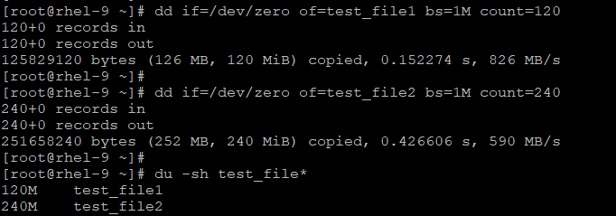
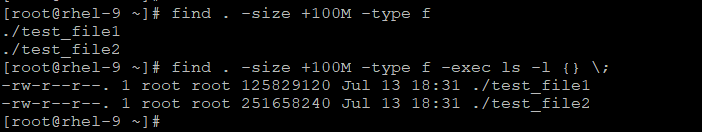
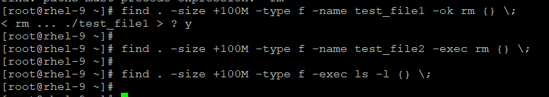

## find command to find the largest file

- lets use `dd` command to create the dummy file
```
# dd if=/dev/zero of=test_file1 bs=1M count=120

# dd if=/dev/zero of=test_file2 bs=1M count=240

#  du -sh test_file*
```



- We can perform the action as well with find command with -exec or -or flag

    **Make sure you use `sudo` if running with non-admin user**

```
# find . -size +100M -type f

# find . -size +100M -type f -exec ls -l {} \;
```



- We can pass rm to `-exec` or `-or` to delete the files, `-exec` will directly delete the files wihout prompting but `-or` will prompt for file deletion.
```
# find . -size +100M -type f -name test_file1 -ok rm {} \;

# find . -size +100M -type f -name test_file2 -exec rm {} \;
```




