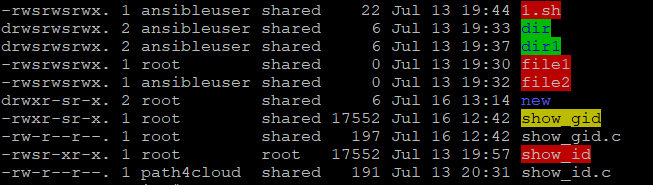

## SUID

To simulate SUID (Set User ID) on an executable, you will create a C Code, but the process runs with the privileges of the file owner, not the user who executed it. When SUID is set on an executable file, any user running it executes the program with the permissions of the file's owner.
```
[root@rhel-9 bit]# cat show_id.c
#include <stdio.h>
#include <unistd.h>
#include <sys/types.h>

int main() {
    printf("Real UID: %d\n", getuid());
    printf("Effective UID (Running as): %d\n", geteuid());
    return 0;
}

(Complie the code with gcc, if not installed then install it as "yum install gcc")
[root@rhel-9 bit]# gcc /opt/bit/show_id.c -o /opt/bit/show_id

(change the ownership and set the suid)
[root@rhel-9 ~]# chown root:root /opt/bit/show_id
[root@rhel-9 ~]# chmod 4755 /opt/bit/show_id

(now run it with normal user)
[root@rhel-9 ~]# ls -l /opt/bit/show_id
-rwsr-xr-x. 1 root root 17552 Jul 13 19:57 /opt/bit/show_id

(switch to different user and run the binary)
[path4cloud@rhel-9 ~]$ /opt/bit/show_id
Real UID: 1000
Effective UID (Running as): 0
```

## SGID

To simulate SGID (Set Group ID) on an executable, you will follow a similar process to SUID, but the process will temporarily inherit the file's group privileges instead of the owner's privileges.When SGID is set on an executable file, any user running it executes the program with the permissions of the file's group owner.
```
[root@rhel-9 ~]# cat /opt/bit/show_gid.c
#include <stdio.h>
#include <unistd.h>
#include <sys/types.h>

int main() {
    printf("Real GID: %d\n", getgid());
    printf("Effective GID (Running as group): %d\n", getegid());
    return 0;
}

(complie the program with gcc)
[root@rhel-9 ~]# gcc /opt/bit/show_gid.c -o /opt/bit/show_gid

(Change the ownership and apply th SGID)
[root@rhel-9 ~]# chown root:shared /opt/bit/show_gid
[root@rhel-9 ~]# chmod 2755 /opt/bit/show_gid

[root@rhel-9 ~]# ls -l /opt/bit/show_gid
-rwxr-sr-x. 1 root shared 15928 Jul 13 20:20 /opt/bit/show_gid

(now run it with normal user and check the group id for the user and effective group id which is same as group of binary)
[root@rhel-9 bit]# su - path4cloud
Last login: Thu Jul 16 12:41:37 IST 2026 on pts/1
[path4cloud@rhel-9 ~]$ /opt/bit/show_gid
Real GID: 1000
Effective GID (Running as group): 1003

[path4cloud@rhel-9 ~]$ id
uid=1000(path4cloud) gid=1000(path4cloud) groups=1000(path4cloud),10(wheel) context=unconfined_u:unconfined_r:unconfined_t:s0-s0:c0.c1023

[path4cloud@rhel-9 ~]$ cat /etc/group | grep -i 1003
shared:x:1003:ansibleuser
```

## Sticky bit

When applied to a directory, it prevents users from deleting or renaming files inside it unless they are the explicit owner of that file or the root user.

```
(switch to user1, here it is path4cloud and try to create a one file under /tmp)
[root@rhel-9 bit]# su - path4cloud
Last login: Thu Jul 16 12:44:05 IST 2026 on pts/1

[path4cloud@rhel-9 ~]$ touch /tmp/path4cloud_file.txt
[path4cloud@rhel-9 ~]$ ll /tmp/path4cloud_file.txt
-rw-r--r--. 1 path4cloud path4cloud 0 Jul 16 12:51 /tmp/path4cloud_file.txt

(now, switch to user2, here it is ansibleuser and try to create another file under /tmp)
[root@rhel-9 bit]# su - ansibleuser
Last login: Thu Jul 16 12:52:04 IST 2026 on pts/1

[ansibleuser@rhel-9 ~]$ touch /tmp/ansibleuser_file.txt
[ansibleuser@rhel-9 ~]$ ll /tmp/ansibleuser_file.txt
-rw-r--r--. 1 ansibleuser ansibleuser 0 Jul 16 12:52 /tmp/ansibleuser_file.txt

(now try to delete the ansibleuser file with path4cloud user, it will not allowed)
[path4cloud@rhel-9 ~]$ rm /tmp/ansibleuser_file.txt
rm: remove write-protected regular empty file '/tmp/ansibleuser_file.txt'? y
rm: cannot remove '/tmp/ansibleuser_file.txt': Operation not permitted

(now try to delete the path4cloud file with ansibleuser user, it will not allowed)
[ansibleuser@rhel-9 ~]$ rm /tmp/path4cloud_file.txt
rm: remove write-protected regular empty file '/tmp/path4cloud_file.txt'? y
rm: cannot remove '/tmp/path4cloud_file.txt': Operation not permitted

(now try to delete the any file with root, it will be allowed)
[root@rhel-9 bit]# rm /tmp/path4cloud_file.txt
rm: remove regular empty file '/tmp/path4cloud_file.txt'? y

[root@rhel-9 ~]# ll /tmp/path4cloud_file.txt
ls: cannot access '/tmp/path4cloud_file.txt': No such file or directory
```

## File Color

We noticed, when the SUID or SGID is applied to a file we have red and yellow color highlighted that file name.

When SUID is applied, the file will be highlighted with red color.
When SGID is applied, the file will be highlighted with yellor color.
When Sticky bit is applied, no color but in permission we can see t/T at the end.



