# SYSTEMD
This is the first process and parent of all other processes in system.
```
[root@rhel-9 ~]# pstree
systemd─┬─NetworkManager───2*[{NetworkManager}]
        ├─agetty
        ├─alertmanager───7*[{alertmanager}]
        ├─atd
        ├─auditd─┬─sedispatch
        │        └─2*[{auditd}]
        ├─chronyd
        ├─crond
        ├─dbus-broker-lau───dbus-broker
        ├─dnsmasq
        ├─irqbalance───{irqbalance}
        ├─node_exporter───7*[{node_exporter}]
        ├─polkitd───5*[{polkitd}]
        ├─prometheus───7*[{prometheus}]
        ├─rhcd─┬─rhc-package-man───4*[{rhc-package-man}]
        │      └─10*[{rhcd}]
        ├─rhsmcertd───{rhsmcertd}
        ├─rsyslogd───2*[{rsyslogd}]
        ├─rtkit-daemon───2*[{rtkit-daemon}]
        ├─sshd───sshd-session───sshd-session───bash───sudo───sudo───bash───pstree
        ├─stratisd───5*[{stratisd}]
        ├─systemd───(sd-pam)
        ├─systemd-journal
        ├─systemd-logind
        ├─systemd-udevd
        ├─tuned───3*[{tuned}]
        ├─udisksd───4*[{udisksd}]
        └─upowerd───2*[{upowerd}]
```
Systemd PID (Process ID) is 1
```
[root@rhel-9 ~]# ps aux | grep -i systemd
root           1  0.0  0.8 109596 14224 ?        Ss   Aug24   0:13 /usr/lib/systemd/systemd --switched-root --system --deserialize 28
root         686  0.0  0.9  53464 16660 ?        Ss   Aug24   0:06 /usr/lib/systemd/systemd-journald
root         701  0.0  0.5  38672  9568 ?        Ss   Aug24   0:00 /usr/lib/systemd/systemd-udevd
root         864  0.0  0.6  31908 10628 ?        Ss   Aug24   0:00 /usr/lib/systemd/systemd-logind
ansible+     932  0.0  0.6  25416 11148 ?        Ss   Aug24   0:00 /usr/lib/systemd/systemd --user
root       10476  0.0  0.1   6424  2628 pts/1    S+   15:57   0:00 grep --color=auto -i systemd
```
We can list all the Process with `ps` command:
```
[root@rhel-9 ~]# ps aux
USER         PID %CPU %MEM    VSZ   RSS TTY      STAT START   TIME COMMAND
root           1  0.0  0.8 109596 14224 ?        Ss   Aug24   0:13 /usr/lib/systemd/systemd --switched-root --system --deserialize 28
root           2  0.0  0.0      0     0 ?        S    Aug24   0:00 [kthreadd]
root           3  0.0  0.0      0     0 ?        S    Aug24   0:00 [pool_workqueue_]
root           4  0.0  0.0      0     0 ?        I<   Aug24   0:00 [kworker/R-rcu_gp]
root           5  0.0  0.0      0     0 ?        I<   Aug24   0:00 [kworker/R-sync_wq]
root           6  0.0  0.0      0     0 ?        I<   Aug24   0:00 [kworker/R-slub_flushwq]
root           7  0.0  0.0      0     0 ?        I<   Aug24   0:00 [kworker/R-netns]
root           9  0.0  0.0      0     0 ?        I<   Aug24   0:00 [kworker/0:0H-events_highpri]
root          10  0.0  0.0      0     0 ?        I    Aug24   0:00 [kworker/u8:0-events_unbound]
root          11  0.0  0.0      0     0 ?        I<   Aug24   0:00 [kworker/R-mm_percpu_wq]
root          12  0.0  0.0      0     0 ?        I    Aug24   0:00 [kworker/u8:1-netns]
root          13  0.0  0.0      0     0 ?        I    Aug24   0:00 [rcu_tasks_kthre]
root          14  0.0  0.0      0     0 ?        I    Aug24   0:00 [rcu_tasks_rude_]
root          15  0.0  0.0      0     0 ?        I    Aug24   0:00 [rcu_tasks_trace]
root          16  0.0  0.0      0     0 ?        S    Aug24   0:00 [ksoftirqd/0]
root          17  0.0  0.0      0     0 ?        I    Aug24   0:03 [rcu_preempt]
root          18  0.0  0.0      0     0 ?        S    Aug24   0:00 [rcu_exp_par_gp_]
root          19  0.0  0.0      0     0 ?        S    Aug24   0:00 [rcu_exp_gp_kthr]
root          20  0.0  0.0      0     0 ?        S    Aug24   0:00 [migration/0]
root          21  0.0  0.0      0     0 ?        S    Aug24   0:00 [idle_inject/0]
```

## Set Process priority
- Create a massive 10GB blank file using `dd`
```
Start two process with different nice values in background

# nice -n 19 dd if=/dev/zero of=/tmp/bigfile bs=1M count=10000 &
(The -n 19 flag assigns the lowest possible priority to this dd task. If the other process suddenly gets a new instruction or required a CPU cycle, the Linux kernel will instantly pause or slow down dd to ensure the other or high priority process gets all the CPU it needs.)
```
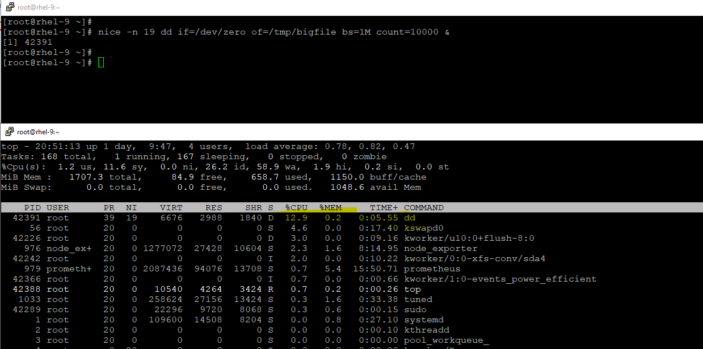
```
Giving Higher Priority
# nice -n -10 dd if=/dev/zero of=/tmp/bigfile1 bs=1M count=10000 &
(chnage the nice value to -10 here, then kernel will give the priroty to this process)
```
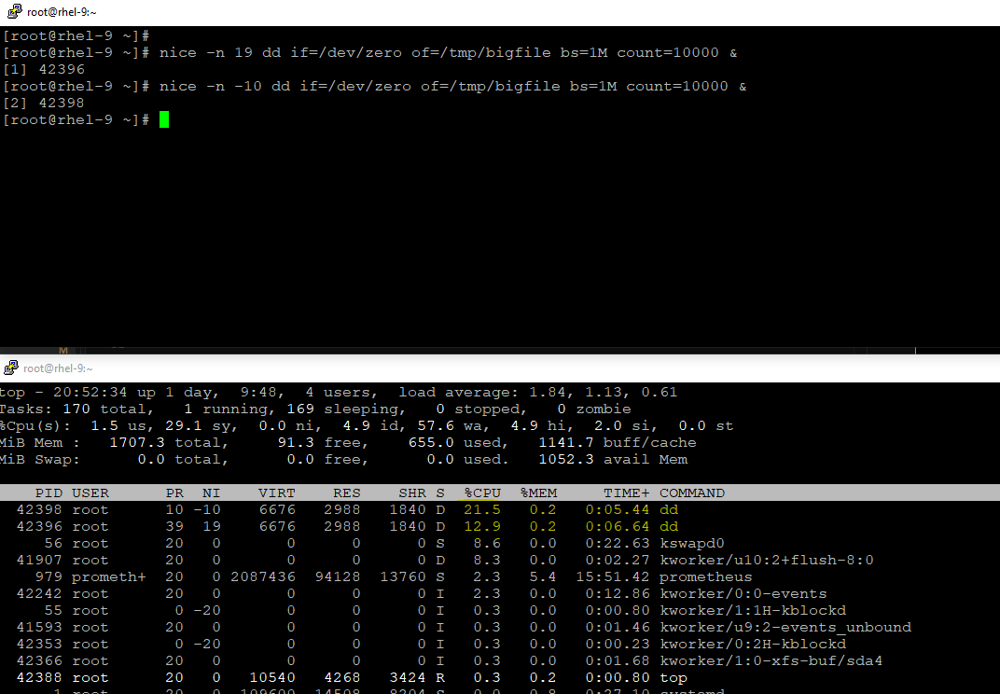

## REAL TIME MONITORING
#### Signals
`# kill -l`

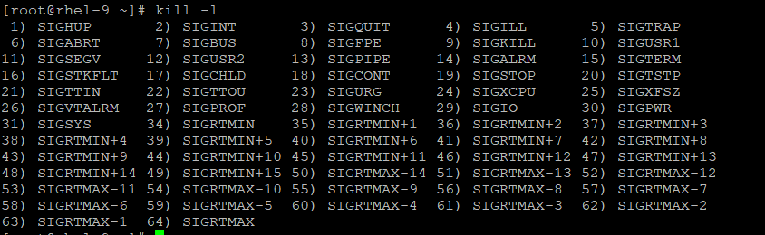
- SIGSTOP (19) and SIGCONT (18) — The Pause & Resume 
```
Want to stop the any process, like db backup or find command or any other process, which is consuming more resource and you are not sure to continue to with it, then we can stop for a while to make a final decision and then continue the same process.

On Terminal 1: Run the dd command
# dd if=/dev/zero of=/tmp/bigfile bs=1M count=10000

On Terminal 2: get the PID of dd command and send the SIGSTOP signal
# ps -ef | grep -i dd
# kill -SIGSTOP <pid>

On Terminal 1: run jobs, you will see, it is stopped:
# jobs
[1]+  Stopped                 dd if=/dev/zero of=/tmp/bigfile bs=1M count=10000

On Terminal 2: send the SIGCONT signal
# kill -SIGCONT

On Terminal 1: run jobs again, you will notice, the process is started again
# jobs
[1]+  Running                 dd if=/dev/zero of=/tmp/bigfile bs=1M count=10000 &
```
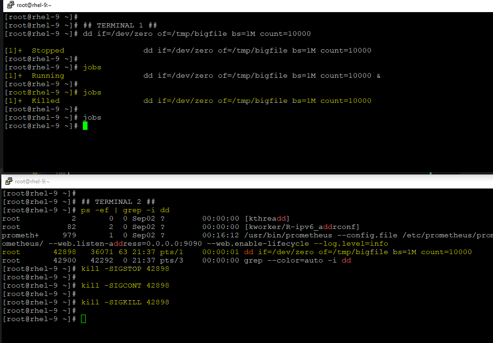

- SIGHUP (1) — Zero-Downtime Configuration Reloads
  - Your website is running live on an Apache web server. You just edited the configuration file to add a new path for index.html or port number. If you run systemctl restart httpd, the server will shut down completely for a few(micro) seconds, dropping active connection or thousands of connected users.
  - The Real-Time Action: You send a hangup signal. This tells the master process to read the new config file and spin up new worker processes, while letting the old worker processes finish serving current users before they die off.
  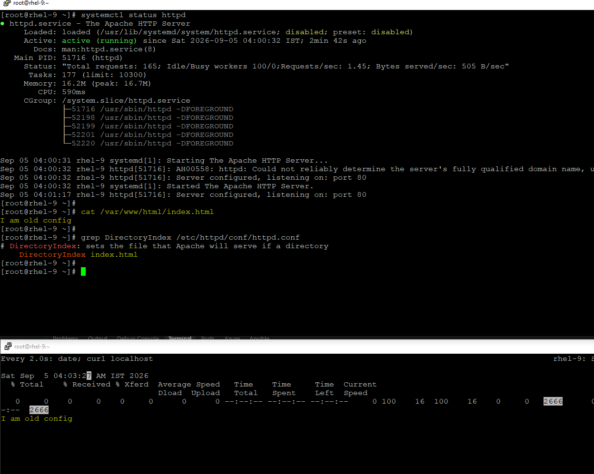
  (httpd running, with default config)

  - Lets, change the default path and restart the service. Notice: connection was dropped and then restarted.
  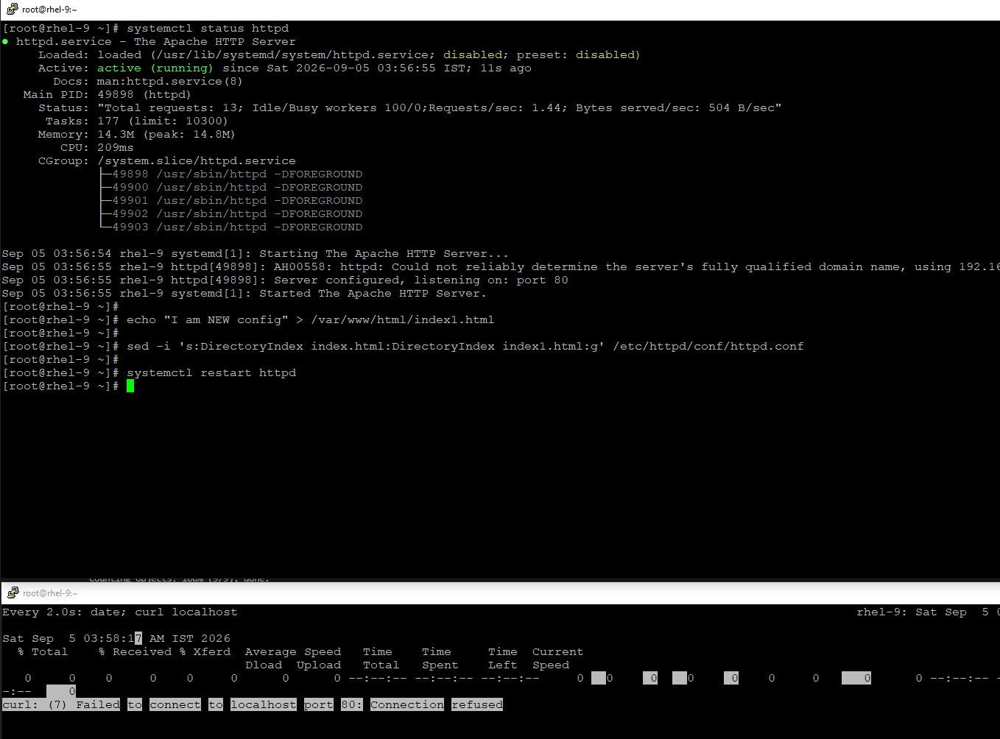
        
        # curl localhost
        I am NEW config

  - Now, lets hangup the process, instead of restarting the process, Notice, no session was dropped. and new config will be picked.
  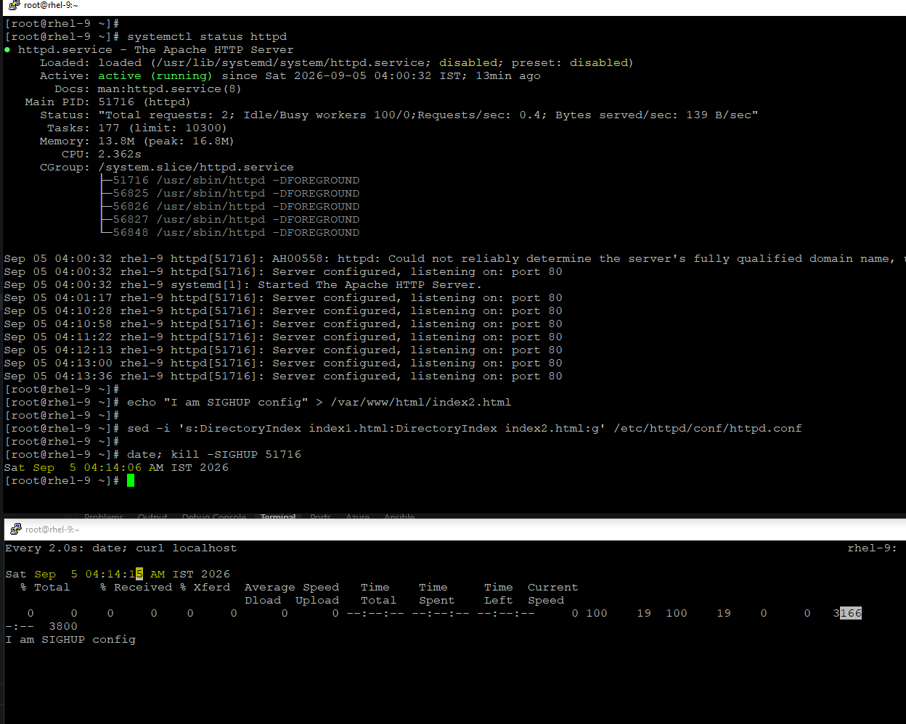


- SIGUSR1 (10) — Triggering Custom Application Behavior
  - It is a custom user-defined signal. The Linux kernel doesn't care what it does; it leaves it entirely up to the application developer to decide how the app reacts when it receives it.
  ```
  # Step 1: You started a massive copy in terminal 1 (PID 7889)
  dd if=/dev/sda of=/dev/sdb bs=4M

  # Step 2: Open terminal 2 and send SIGUSR1 to peek at its progress
  kill -10 <pid>>   # or: kill -SIGUSR1 <pid>

  # Result: Terminal 1 will instantly print a status update showing 
  # exactly how many Gigabytes it has copied so far, and keep running!
  ```
  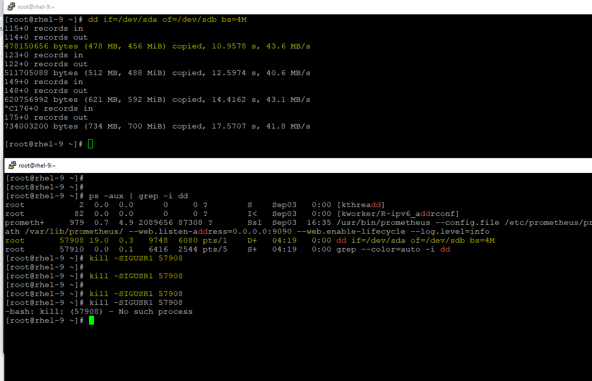    

#### top
```
- UPTIME : System Time, Uptime, Users, Load Average
- TASKS:
        total: Indicates the total count of processes currently being tracked by the system.
        running: Represents the number of processes currently actively using CPU time.
        sleeping: Refers to processes that are currently idle and waiting for a signal to wake up.
        stopped: Denotes processes that have been manually stopped, typically through a signal.
        zombie: Indicates processes that have completed execution but still have an entry in the process table.

- %Cpu(s)
        us: Percentage of CPU time spent running user processes.
        sy: Percentage of CPU time spent running kernel (system) processes.
        ni: Percentage of CPU time spent running processes with a nice value (priority adjusted).
        id: Percentage of CPU time spent idle (no work being done).
        wa: Percentage of CPU time spent waiting for I/O operations to complete.
        hi: Percentage of CPU time spent servicing hardware interrupts.
        si: Percentage of CPU time spent servicing software interrupts.
        st: Percentage of CPU time stolen from this virtual machine by the hypervisor (if virtualized).

Memory:
        total: Total amount of physical memory (RAM) available in MiB.
        used: Amount of RAM currently in use by processes and the kernel.
        free: Amount of RAM not in use.
        buff/cache: Amount of memory used for buffering data and caching filesystems.

Swap : 
        total: Total amount of swap space available in MiB.
        used: Amount of swap space currently in use.
        free: Amount of swap space that is not being used.
        available: Estimate of how much memory is available for starting new applications without swapping.

lists active processes:
        PID: Shows task’s unique process id.
        USER: User name of owner of task.
        PR: The process’s priority. The lower the number, the higher the priority.
        NI: Represents a Nice Value of task. A Negative nice value implies higher priority, and positive Nice value means lower priority.
        VIRT: Total virtual memory used by the task.
        RES: How much physical RAM the process is using, measured in kilobytes.
        SHR: Represents the Shared Memory size (kb) used by a task.
        %CPU: Represents the CPU usage.
        %MEM: Shows the Memory usage of task.
        TIME+: CPU Time, the same as ‘TIME’, but reflecting more granularity through hundredths of a second.
        COMMAND: The name of the command that started the process.
```
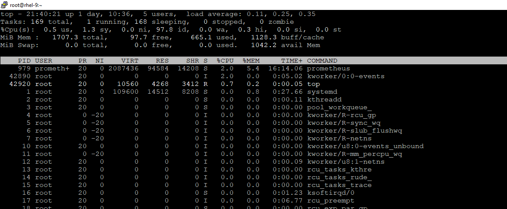

- Common flags/options with top:
```
Find and Kill a Resource-Hogging Process
Step 1: While top is running, press P (Shift + P) to sort all active processes by %CPU usage. Identify the PID (Process ID) of the problematic application.
Step 2: Press k.
Step 3: The terminal will prompt: PID to signal/kill [default mit PID]:. Type the PID number and hit Enter.
Step 4: It will ask for a signal type. Type 15 for a graceful termination or 9 to force-kill it immediately, then press Enter.


Diagnose Out-of-Memory (OOM) Issues
# top -o %MEM
Alternative Interactive Key: If you already have top open, press M (Shift + M).


Monitor a Specific User's Activity
# top -u <username>
Alternative Interactive Key: While inside a general top session, press u and type the target username.


Capture a Performance Snapshot (Batch Mode)
# top -b -n 1 (The -n 1 flag ensures it exits instantly after printing one snapshot)

While top is running, press h, for more help
```
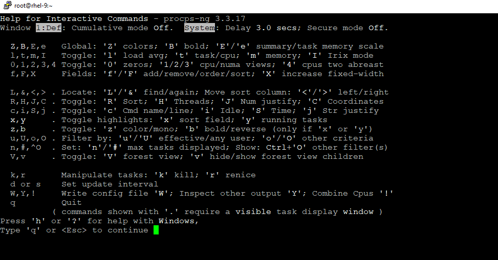

#### iostat
```
When you run iostat -x 1 5, the first report shows averages since the system booted. The subsequent 4 reports show live data sampled every 1 second.

# iostat -x 1 5

- r/s & w/s (Reads/Writes per second): This is your IOPS (Input/Output Operations Per Second). High numbers mean your application is making thousands of tiny requests (common in unindexed databases).
- rkB/s & wkB/s (Read/Write Kilobytes per second): The actual throughput (data transfer speed). If a backup or file copy is running, you will see this spike.
- aqu-sz (Average Queue Size): The number of I/O requests that are queued up waiting to be processed by the disk. A number consistently greater than 2 or 3 per disk core means requests are backing up.
- await (Average Wait Time): The total time (in milliseconds) it took for an I/O request to be completed from the moment it was issued.
- %util (Percentage of CPU time spent handling requests): This tells you how busy the disk device is. If it is at 100%, the disk is fully saturated.
```
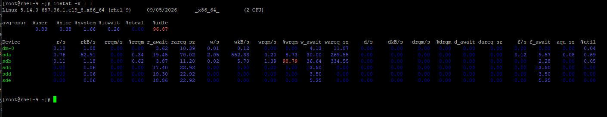

#### vmstat
- vmstat is incredibly lightweight. If your server is completely locking up and heavy commands like top fail to load, vmstat will usually still work.
```
# vmstat 1 2
procs -----------memory---------- ---swap-- -----io---- -system-- ------cpu-----
 r  b   swpd   free   buff  cache   si   so    bi    bo   in   cs us sy id wa st
 0  0      0  74984 732176 338492    0    0    27   281  165   37  1  2 97  0  0
 0  0      0  74984 732176 338520    0    0     0     0  401  455  1  2 97  0  0

procs (Processes)
- r (Runnable): The number of processes waiting for CPU time. If this number is consistently higher than the number of CPU cores you have, your system is experiencing a CPU bottleneck.
- b (Blocked): The number of processes sitting in uninterrupted sleep, usually waiting for disk I/O or network responses. If b is greater than 0, things are getting stuck.

memory
- swpd: Amount of virtual memory used.
- free: Idle memory.
- buff & cache: Memory used by the OS as buffers and OS cache to speed up disk reads. Linux will automatically reclaim this if applications need RAM, so a low free but high cache is completely healthy!

swap (Paging)
- si (Swap-In) & so (Swap-Out): The amount of memory paged in/out from disk per second. These should ideally be 0. If so is consistently active, your server has run out of physical RAM and is aggressively forcing data onto the slow storage drive.

io (Input / Output)
- bi (Blocks In) & bo (Blocks Out): Blocks received from / sent to a block device (disk). This is a simplified version of iostat.

cpu (Percentages of total CPU time)
- us (User): Time spent running non-kernel code (your apps, web servers, databases).
- sy (System): Time spent running kernel code. If this is high, the OS is spending too much time managing context switching or hardware interrupts rather than running your apps.
- id (Idle): Time the CPU is completely twiddling its thumbs.
- wa (Wait): Time spent waiting for IO. This is crucial. A high wa percentage means your CPU is fast, but it is being handcuffed by a slow disk.
- st stands for "Steal Time":  represents the percentage of CPU power that your virtual machine (VM) wanted to use, but was physically blocked from using because the physical host server was busy giving that CPU power to a different virtual machine.
```

#### SAR (System Activity Reporter)
- sar -u: displays your RHEL 9 server's historical CPU utilization logged over the last hour, broken down into 10-minute intervals.
```
sar -u
Linux 5.14.0-687.36.1.el9_8.x86_64 (rhel-9)     09/05/2026      _x86_64_        (2 CPU)

03:37:44 AM     CPU     %user     %nice   %system   %iowait    %steal     %idle
03:40:00 AM     all     12.50      1.40      8.64      7.97      0.00     69.49
03:50:01 AM     all     14.46      0.15      4.71      2.85      0.00     77.83
04:00:00 AM     all      7.01      0.26      3.90      0.81      0.00     88.02
04:10:03 AM     all      1.80      0.00      3.57      0.03      0.00     94.59
04:20:03 AM     all      0.88      1.38      2.74      2.13      0.00     92.88
04:30:00 AM     all      0.40      0.00      1.44      0.03      0.00     98.13
04:40:04 AM     all      0.41      0.00      1.50      0.02      0.00     98.08
Average:        all      4.44      0.34      3.18      1.22      0.00     90.82


- 03:40:00 AM ... all: The timestamp of the log snapshot. all means this row represents the combined average across both of your CPU cores ((2 CPU)).
- %user (User Apps): The percentage of time spent running your standard applications 
- %nice (Low Priority tasks): The time spent running processes whose priorities were altered using the nice command we discussed earlier.
- %system (Kernel Operations): CPU time spent handling core OS tasks like memory allocation, network traffic routing, or managing hardware drivers.
- %iowait (Disk Waiting): This is your most critical metric from this log. This tells us that your CPU execution loops were actively bottlenecked by slow disk storage operations
- %steal (Stolen Virtualization Power): This reads 0.00% across the board. Just like in your vmstat output, this confirms your virtual machine hypervisor is perfectly stable.
- %idle (Unused Power): The percentage of time the CPU was completely free. 
```

- sar -r: output shows the historical analysis of your server's memory (RAM) allocation over the last hour.
```
sar -r
Linux 5.14.0-687.36.1.el9_8.x86_64 (rhel-9)     09/05/2026      _x86_64_        (2 CPU)

03:37:44 AM kbmemfree   kbavail kbmemused  %memused kbbuffers  kbcached  kbcommit   %commit  kbactive   kbinact   kbdirty
03:40:00 AM     88208    840000    643384     36.80      3212    777904   2665488    152.46    378644    730580       164
03:50:01 AM     83164    526452    958504     54.83       596    469512   3003820    171.81    784644    348916        92
04:00:00 AM    493128    963200    522472     29.88       596    496660   2536100    145.06    336980    381688        96
04:10:03 AM    488124    960948    524712     30.01       596    499416   2536612    145.09    358876    363324       208
04:20:03 AM    113656    982088    501940     28.71    732176    152864   2975712    170.21    190168    917832       248
04:30:00 AM     78256    955120    529012     30.26    732176    161212   2975712    170.21    197816    918528       116
04:40:04 AM     74480    952440    531780     30.42    732176    162308   2975328    170.18    199572    919048       128
04:50:02 AM     71960    951712    532504     30.46    732176    164112   2975328    170.18    200204    919516       184
Average:       186372    891495    593038     33.92    366713    360498   2830512    161.90    330863    687429       154


- kbmemfree: Physical RAM that is completely empty and untouched. 
- kbavail (Available RAM): This is the most important number. It tells you how much RAM is actually available to start new applications without swapping.
- kbmemused & %memused: The amount and percentage of physical RAM currently consumed by the OS and running processes. 
- kbbuffers: RAM used to temporarily store low-level raw disk block data before it gets written or read.
- kbcached: RAM used to cache actual files read from the disk to speed up subsequent reads.
- kbcommit & %commit: The amount of memory the OS has promised to applications if they ever ask for it. 
- kbactive vs kbinact: Active memory is RAM that was used very recently; inactive memory is RAM that hasn't been touched in a while and can be easily cleared out by the kernel if a heavy application launches.
- kbdirty: Memory waiting to be physically written to the hard drive. 
```

- sar -b: tracks overall I/O (Input/Output) and transfer rates across all your storage block devices. It shows how hard your hard drives or SSDs are working to read and write data.
```
sar -b
Linux 5.14.0-687.36.1.el9_8.x86_64 (rhel-9)     09/05/2026      _x86_64_        (2 CPU)

03:37:44 AM       tps      rtps      wtps      dtps   bread/s   bwrtn/s   bdscd/s
03:40:00 AM     86.78     72.51     14.27      0.00   3698.01   1086.81      0.00
03:50:01 AM     26.19     19.39      6.80      0.00   3015.22    199.57      0.00
04:00:00 AM      6.57      3.53      3.04      0.00    189.04     41.55      0.00
04:10:03 AM      2.18      0.09      2.09      0.00      2.11     29.83      0.00
04:20:03 AM      7.24      3.22      4.01      0.00   3043.72   2416.63      0.00
04:30:00 AM      1.81      0.19      1.62      0.00     26.26     18.67      0.00
04:40:04 AM      1.48      0.05      1.43      0.00      2.09     16.97      0.00
04:50:02 AM      1.50      0.09      1.41      0.00      4.27     16.92      0.00
Average:         9.23      5.95      3.27      0.00    985.74    413.22      0.00


- tps (Transactions Per Second): The total number of I/O requests issued to physical devices per second. A "transaction" can be a read or a write.
- rtps (Read Transactions Per Second): How many separate read requests were sent to the disk per second.
- wtps (Write Transactions Per Second): How many separate write requests were sent to the disk per second.
- dtps (Discard Transactions Per Second): Discard/TRIM commands issued to free up space on SSDs.
- bread/s (Blocks Read Per Second): The amount of data read from your disks, measured in Linux sectors/blocks (usually 512 bytes per block).
- bwrtn/s (Blocks Written Per Second): The amount of data actively written to your disks per second. 
- bdscd/s (Blocks Discarded Per Second): The volume of blocks discarded via TRIM commands per second.
```

- sar -d:  output provides the ultimate breakdown by tracking activity on individual drive partitions and disk devices.
```
 sar -d
Linux 5.14.0-687.36.1.el9_8.x86_64 (rhel-9)     09/05/2026      _x86_64_        (2 CPU)

03:37:44 AM       DEV       tps     rkB/s     wkB/s     dkB/s   areq-sz    aqu-sz     await     %util
03:40:00 AM       sdb     35.95    262.20      0.01      0.00      7.29      0.18      4.95     17.48
03:40:00 AM       sda     49.76   1560.99    543.40      0.00     42.29      0.67     12.98     30.79
03:40:00 AM       sde      0.36      8.60      0.00      0.00     23.92      0.01     15.90      0.36
03:40:00 AM       sdc      0.36      8.60      0.00      0.00     23.92      0.00      9.18      0.32
03:40:00 AM       sdd      0.36      8.60      0.00      0.00     23.92      0.00     13.47      0.34
03:40:00 AM      dm-0     36.48    259.12      0.01      0.00      7.10      0.18      5.05     17.33
03:50:01 AM       sdb      0.15      5.77      0.06      0.00     38.52      0.00     14.78      0.15
03:50:01 AM       sda     25.77   1496.19     99.72      0.00     61.92      0.23      8.61      6.85
03:50:01 AM       sde      0.09      1.88      0.00      0.00     20.96      0.00     19.69      0.14
03:50:01 AM       sdc      0.09      1.88      0.00      0.00     20.96      0.00     13.37      0.10

- DEV: The specific block device name (e.g., standard SCSI disks sda-sde, or Device Mapper dm-0).
- tps (Transactions Per Second): The number of I/O transfer requests issued to this specific disk per second.
- rkB/s & wkB/s: Kilobytes read or written to the device per second.
- areq-sz (Average Request Size): The average size (in Kilobytes) of the I/O requests sent to the drive.
- aqu-sz (Average Queue Size): The number of requests waiting in line to be serviced by the drive hardware. 
- await (Average Wait Time): The total time in milliseconds from when a request was made until it was completely finished.
- %util (Percentage of Disk Saturation): How busy the drive physically was. 
```

- sar -W: output tracks your server's swapping activity (moving memory pages out of physical RAM and onto your hard drive swap partition).
```
sar -W
Linux 5.14.0-687.36.1.el9_8.x86_64 (rhel-9)     09/05/2026      _x86_64_        (2 CPU)

03:37:44 AM  pswpin/s pswpout/s
03:40:00 AM      0.00      0.00
03:50:01 AM      0.00      0.00
04:00:00 AM      0.00      0.00
04:10:03 AM      0.00      0.00
04:20:03 AM      0.00      0.00
04:30:00 AM      0.00      0.00
04:40:04 AM      0.00      0.00
04:50:02 AM      0.00      0.00
05:00:05 AM      0.00      0.00
Average:         0.00      0.00

- pswpin/s (Pages Swapped In per second): The number of memory pages the operating system had to fetch back from the swap partition on the hard drive into physical RAM.
- pswpout/s (Pages Swapped Out per second): The number of memory pages the operating system actively forced out of physical RAM and wrote onto the hard drive swap space to free up room for other apps.
```