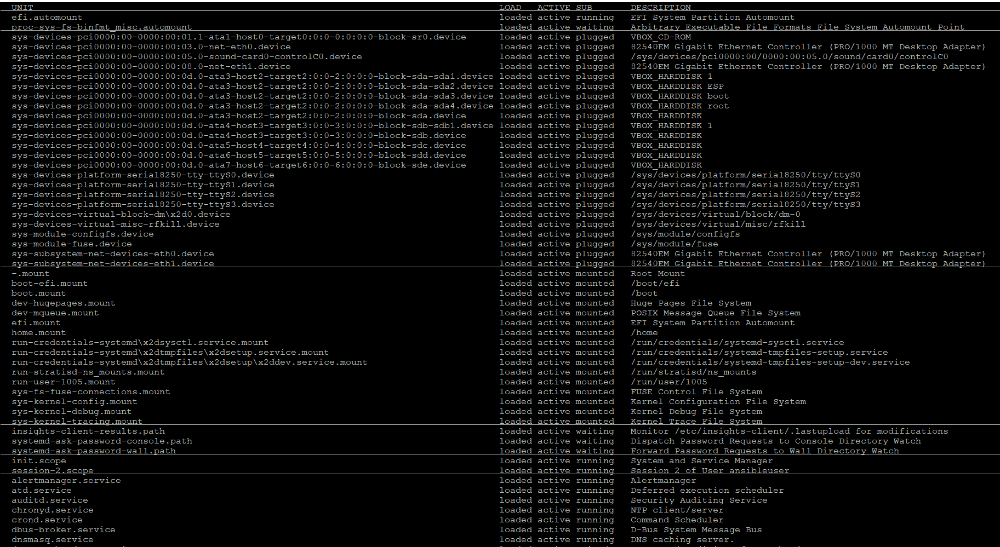
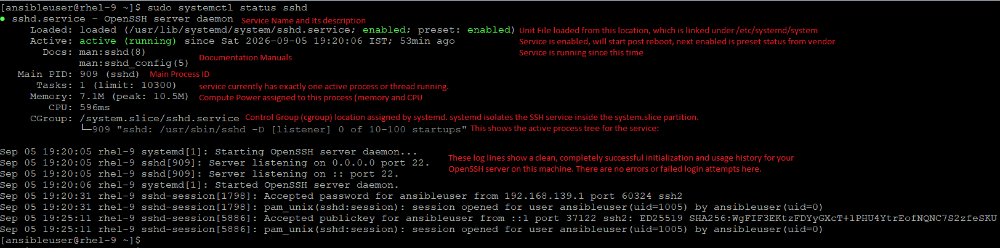
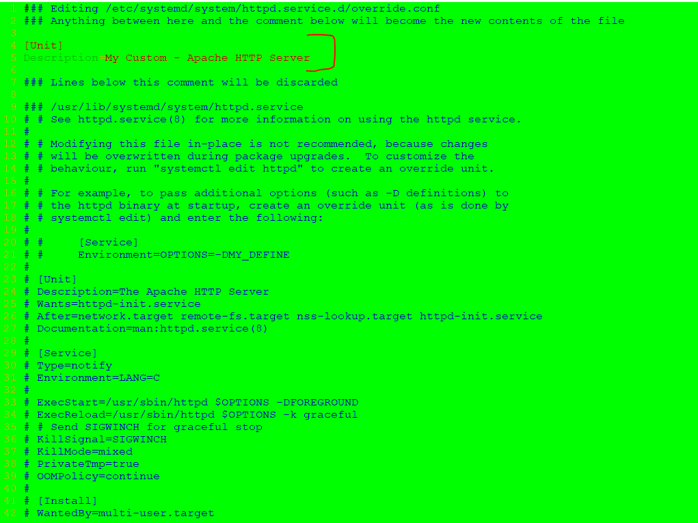
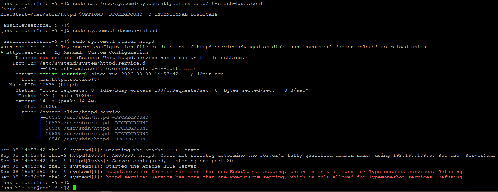
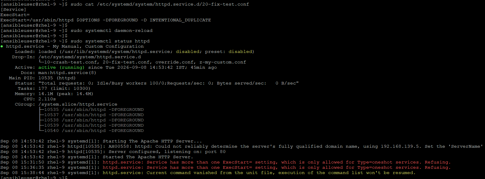
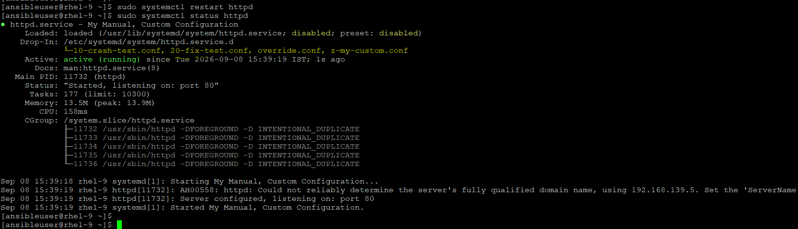

## SYSTEMD
- systemd process is top-most process
```
[ansibleuser@rhel-9 ~]$ pstree -p
systemd(1)─┬─NetworkManager(849)─┬─{NetworkManager}(891)
           │                     └─{NetworkManager}(893)
           ├─agetty(928)
           ├─alertmanager(963)─┬─{alertmanager}(1295)
           │                   ├─{alertmanager}(1388)
           │                   ├─{alertmanager}(1389)
           │                   ├─{alertmanager}(1390)
           │                   ├─{alertmanager}(2324)
           │                   ├─{alertmanager}(2325)
           │                   └─{alertmanager}(2326)
           ├─atd(926)
           ├─auditd(813)─┬─sedispatch(815)
           │             ├─{auditd}(814)
           │             └─{auditd}(816)
           ├─chronyd(880)
           ├─crond(927)
           ├─dbus-broker-lau(842)───dbus-broker(848)
           ├─dnsmasq(945)
```
Service Management Commands

- List all units: # systemctl list-units



- List only a specific unit type: # systemctl list-units -t service
```
$ systemctl list-units -t service
  UNIT                                                  LOAD   ACTIVE SUB     DESCRIPTION
  alertmanager.service                                  loaded active running Alertmanager
  atd.service                                           loaded active running Deferred execution scheduler
  auditd.service                                        loaded active running Security Auditing Service
  chronyd.service                                       loaded active running NTP client/server
  crond.service                                         loaded active running Command Scheduler
  dbus-broker.service                                   loaded active running D-Bus System Message Bus
  dnsmasq.service                                       loaded active running DNS caching server.
  dracut-shutdown.service                               loaded active exited  Restore /run/initramfs on shutdown
  getty@tty1.service                                    loaded active running Getty on tty1
  irqbalance.service                                    loaded active running irqbalance daemon
  kdump.service                                         loaded active exited  Crash recovery kernel arming
  kmod-static-nodes.service                             loaded active exited  Create List of Static Device Nodes
  lm_sensors.service                                    loaded active exited  Hardware Monitoring Sensors
  lvm2-monitor.service                                  loaded active exited  Monitoring of LVM2 mirrors, snapshots etc. using dmeventd or progress polling
  NetworkManager-wait-online.service                    loaded active exited  Network Manager Wait Online
  NetworkManager.service                                loaded active running Network Manager
  nis-domainname.service                                loaded active exited  Read and set NIS domainname from /etc/sysconfig/network
  node_exporter.service                                 loaded active running Node Exporter
  polkit.service                                        loaded active running Authorization Manager
  prometheus.service                                    loaded active running Prometheus
  rhcd.service                                          loaded active running Remote Host Configuration daemon
  rhsmcertd.service                                     loaded active running Enable periodic update of entitlement certificates.
● rngd.service                                          loaded failed failed  Hardware RNG Entropy Gatherer Daemon
  rsyslog.service                                       loaded active running System Logging Service
  rtkit-daemon.service                                  loaded active running RealtimeKit Scheduling Policy Service
  sshd.service                                          loaded active running OpenSSH server daemon
.
.
.
LOAD   = Reflects whether the unit definition was properly loaded.
ACTIVE = The high-level unit activation state, i.e. generalization of SUB.
SUB    = The low-level unit activation state, values depend on unit type.
```
- List all services (loaded or not-loaded): # systemctl list-units -t service -all
```
$ systemctl list-units -t service -all
  UNIT                                                  LOAD      ACTIVE   SUB     DESCRIPTION
  alertmanager.service                                  loaded    active   running Alertmanager
  atd.service                                           loaded    active   running Deferred execution scheduler
  auditd.service                                        loaded    active   running Security Auditing Service
● auto-cpufreq.service                                  not-found inactive dead    auto-cpufreq.service
● autofs.service                                        not-found inactive dead    autofs.service
  blk-availability.service                              loaded    inactive dead    Availability of block devices
  chronyd.service                                       loaded    active   running NTP client/server
  cpupower.service                                      loaded    inactive dead    Configure CPU power related settings
  crond.service                                         loaded    active   running Command Scheduler
  dbus-broker.service                                   loaded    active   running D-Bus System Message Bus
● display-manager.service                               not-found inactive dead    display-manager.service
  dm-event.service                                      loaded    inactive dead    Device-mapper event daemon
  dnf-makecache.service                                 loaded    inactive dead    dnf makecache
  dnsmasq.service                                       loaded    active   running DNS caching server.
  dracut-cmdline.service                                loaded    inactive dead    dracut cmdline hook
  dracut-initqueue.service                              loaded    inactive dead    dracut initqueue hook
```
- Similarly, we can specify the all unit types to systemctl command to check those.

### Checking Service status
```
$ sudo systemctl status sshd
● sshd.service - OpenSSH server daemon
     Loaded: loaded (/usr/lib/systemd/system/sshd.service; enabled; preset: enabled)
     Active: active (running) since Sat 2026-09-05 19:20:06 IST; 53min ago
       Docs: man:sshd(8)
             man:sshd_config(5)
   Main PID: 909 (sshd)
      Tasks: 1 (limit: 10300)
     Memory: 7.1M (peak: 10.5M)
        CPU: 596ms
     CGroup: /system.slice/sshd.service
             └─909 "sshd: /usr/sbin/sshd -D [listener] 0 of 10-100 startups"

Sep 05 19:20:05 rhel-9 systemd[1]: Starting OpenSSH server daemon...
Sep 05 19:20:05 rhel-9 sshd[909]: Server listening on 0.0.0.0 port 22.
Sep 05 19:20:05 rhel-9 sshd[909]: Server listening on :: port 22.
Sep 05 19:20:06 rhel-9 systemd[1]: Started OpenSSH server daemon.
Sep 05 19:20:31 rhel-9 sshd-session[1798]: Accepted password for ansibleuser from 192.168.139.1 port 60324 ssh2
Sep 05 19:20:31 rhel-9 sshd-session[1798]: pam_unix(sshd:session): session opened for user ansibleuser(uid=1005) by ansibleuser(uid=0)
Sep 05 19:25:11 rhel-9 sshd-session[5886]: Accepted publickey for ansibleuser from ::1 port 37122 ssh2: ED25519 SHA256:WgFIF3EKtzFDYyGXcT+1PHU4YtrEofNQNC7S2zfeSKU
Sep 05 19:25:11 rhel-9 sshd-session[5886]: pam_unix(sshd:session): session opened for user ansibleuser(uid=1005) by ansibleuser(uid=0)
```



## Customizing Unit File
- We will modify the httpd service description here, first check the status:
```
$ sudo systemctl status httpd
● httpd.service - The Apache HTTP Server
     Loaded: loaded (/usr/lib/systemd/system/httpd.service; disabled; preset: disabled)
     Active: active (running) since Sat 2026-09-05 20:21:53 IST; 2 days ago
       Docs: man:httpd.service(8)
   Main PID: 6820 (httpd)
     Status: "Total requests: 0; Idle/Busy workers 100/0;Requests/sec: 0; Bytes served/sec:   0 B/sec"
      Tasks: 177 (limit: 10300)
     Memory: 16.3M (peak: 18.8M)
        CPU: 8.802s
     CGroup: /system.slice/httpd.service
             ├─6820 /usr/sbin/httpd -DFOREGROUND
             ├─6821 /usr/sbin/httpd -DFOREGROUND
             ├─6822 /usr/sbin/httpd -DFOREGROUND
             ├─6823 /usr/sbin/httpd -DFOREGROUND
             └─6824 /usr/sbin/httpd -DFOREGROUND

Sep 05 20:21:52 rhel-9 systemd[1]: Starting The Apache HTTP Server...
Sep 05 20:21:52 rhel-9 httpd[6820]: AH00558: httpd: Could not reliably determine the server's fully qualified domain name, using 192.168.139.5. Set the 'ServerName' directive globally to su>
Sep 05 20:21:53 rhel-9 httpd[6820]: Server configured, listening on: port 80
Sep 05 20:21:53 rhel-9 systemd[1]: Started The Apache HTTP Server.
```
- The Recommended Way (Using systemctl edit)
```
$ sudo systemctl edit httpd.service
```



- Reload the daemon and notice the description is changed:
```
$ sudo systemctl status httpd
● httpd.service - My Custom - Apache HTTP Server
     Loaded: loaded (/usr/lib/systemd/system/httpd.service; disabled; preset: disabled)
    Drop-In: /etc/systemd/system/httpd.service.d
             └─override.conf
     Active: active (running) since Tue 2026-09-08 14:53:42 IST; 15min ago
       Docs: man:httpd.service(8)
   Main PID: 10535 (httpd)
     Status: "Total requests: 0; Idle/Busy workers 100/0;Requests/sec: 0; Bytes served/sec:   0 B/sec"
      Tasks: 177 (limit: 10300)
     Memory: 14.1M (peak: 14.4M)
        CPU: 860ms
     CGroup: /system.slice/httpd.service
             ├─10535 /usr/sbin/httpd -DFOREGROUND
             ├─10537 /usr/sbin/httpd -DFOREGROUND
             ├─10538 /usr/sbin/httpd -DFOREGROUND
             ├─10539 /usr/sbin/httpd -DFOREGROUND
             └─10540 /usr/sbin/httpd -DFOREGROUND

Sep 08 14:53:42 rhel-9 systemd[1]: Starting The Apache HTTP Server...
Sep 08 14:53:42 rhel-9 httpd[10535]: AH00558: httpd: Could not reliably determine the server's fully qualified domain name, using 192.168.139.5. Set the 'ServerName' directive globally to s>
Sep 08 14:53:42 rhel-9 httpd[10535]: Server configured, listening on: port 80
Sep 08 14:53:42 rhel-9 systemd[1]: Started The Apache HTTP Server.
```
- Notice, it has created a drop-in directory structure:
```
Drop-In: /etc/systemd/system/httpd.service.d
             └─override.conf

$ sudo ls -l /etc/systemd/system/httpd.service.d
total 4
-rw-r--r--. 1 root root 49 Sep  8 15:07 override.conf
```
- Now, create one manually file under this and verify the decsription again, which proves the .d drop-in directories using a strict lexicographical (alphabetical and numerical) sorting order.
```
$ sudo vim /etc/systemd/system/httpd.service.d/10-my-custom.conf
$ cat /etc/systemd/system/httpd.service.d/10-my-custom.conf
Unit]
Description=My Manual, Custom Configuration
$ sudo systemctl daemon-reload
$ sudo systemctl status httpd
● httpd.service - My Custom - Apache HTTP Server
     Loaded: loaded (/usr/lib/systemd/system/httpd.service; disabled; preset: disabled)
    Drop-In: /etc/systemd/system/httpd.service.d
             └─10-my-custom.conf, override.conf
     Active: active (running) since Tue 2026-09-08 14:53:42 IST; 21min ago
```
- Analyzing the Execution Order
    - systemd reads these left-to-right, meaning it parses them in this sequence:
        - 10-my-custom.conf is read first because it starts with a number (1). It sets the description to "My Manual, Custom Configuration".
        - override.conf is read second because letters sort after numbers. 
    - Because override.conf was processed last, its contents completely overwrote your changes in 10-my-custom.conf. Whatever Description= value you have inside override.conf is what won the conflict.
- Rename the custom file:
```
$ sudo mv /etc/systemd/system/httpd.service.d/10-my-custom.conf /etc/systemd/system/httpd.service.d/z-my-custom.conf
$ sudo systemctl daemon-reload
$ sudo systemctl status httpd
● httpd.service - My Manual, Custom Configuration
     Loaded: loaded (/usr/lib/systemd/system/httpd.service; disabled; preset: disabled)
    Drop-In: /etc/systemd/system/httpd.service.d
             └─override.conf, z-my-custom.conf
     Active: active (running) since Tue 2026-09-08 14:53:42 IST; 25min ago
```

- Simulate the CRASH if a LIST or ARRAY has more than one values:



- Now, correct this by creating a another file with high-priority:



- Verify with restart as well:

