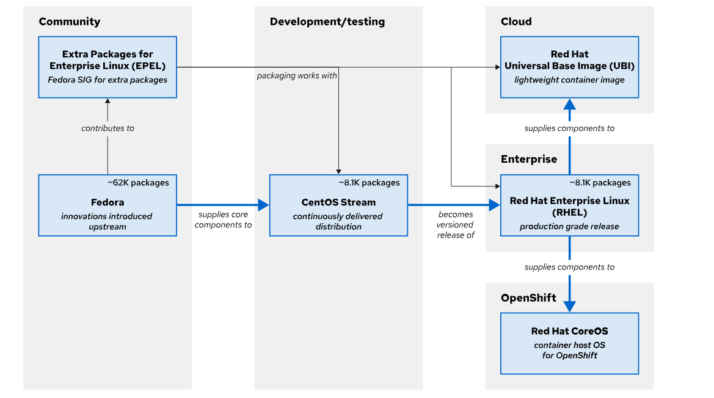
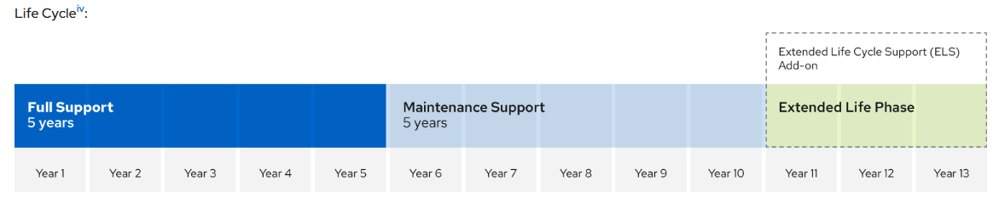

 
 # RHCSA (A Quick Intro)

This repository is designed to help you master RHCSA (Red Hat Certified System Administrator) using RHEL 9 and RHEL 10 with:

- 📚 Structured learning path
- 💻 Hands-on labs
- ⚙️ Real-world Linux administration tasks
- 🎯 Exam-focused preparation

## 🔴 What is LINUX?

Linux is an open-source operating system (OS) that manages your computer’s hardware and allows software to run—just like Windows or macOS.
At its core, Linux is based on the Linux kernel, which was created by Linus Torvalds.

👉 Linux = Kernel + Tools + Applications = Operating System

- Linux acts as a bridge between:
    - 🧠 Hardware (CPU, RAM, Disk)
    - 💻 Software (apps, programs)

- It handles:
    - Process management
    - Memory management
    - File systems
    - Security

## 🌍 Why Linux is Important?

Linux is everywhere, it is being used worldwide. As of today, it is a criticical technology for IT Professional to understand the Linux to deal with all other technolgies. When a user interacts with web application using internet (world wide web) then most of the applicaiton builts and runs on Linux. 

Linux manaages sales (POS) systems, stock market applicaiton, smart appliances, runs most of the top supercomputers in the world. It is the core technologies that powers the cloud revolution and container based microservices application.

 The `GREAT` thing about `LINUX` is: It is an `OPEN SOURCE` means we can see how this works and we have access to source code and we can easily experiment with source code, update/modify and also share with with others to use which leads to improvement and innovation in source code. 

 Linux provides a `CLI` (Command Line Interface) which makes it easy to manager and perform other adiminstation tasks for automation, deployment and managing application locally or remotly. 

 ## 🔓 What is Open Source?

 Open Source Software is available to everyone with source code that anyone can use, experiment, modify and share with others. Source code is the set of human-readable instructions that are used to make a program. Code might be in interpretive form, such as a script, or compiled into a binary executable that the computer runs directly.

 Source code becomes copyrighted when created, and the copyright holder controls the terms under which the software can be copied, adapted, and distributed. Users can use the software according to its software license.

 Some software uses closed source that Only the creator/company can see or change the code
Users can only run the software, No access to modify or share. 

Open Source Software: The creator allows everyone to run the software, view the code, modify it and share it with others. Usually free to use and distribute.

## 📜 Types of Open Source Licenses

Open-source licenses define how you can use, modify, and share code.

- 👉 All open-source licenses allow you to:
    - Use the software
    - View the source code
    - Modify it
    - Share it

But the rules for sharing are different.

* **🔁 1. Copyleft Licenses (Share-Alike)**
        
        Idea: “If you use it, you must keep it open.”

    If you modify or distribute the software → you must share your changes as open source

    ✅ Keeps software free and open forever
    
    ❗ Cannot make it fully private/proprietary

    Examples:

        GNU General Public License

        GNU Lesser General Public License

* **🔓 2. Permissive Licenses**

        Idea: “Do whatever you want, just give credit.”

    You can: Modify code. Use it in private/proprietary software, Sell it. Only requirement → keep original license notice

    ✅ Very flexible

    ❗ Companies can make it closed-source later

    Examples:

        MIT License
        BSD License
        Apache License 2.0

## Who Creates Open Source Software?

Open source is built by companies, developers, and communities working together to create and improve software.

**🏢 Companies & Professional Developers**

- Most open-source work today is done by developers paid by companies
- Organizations invest in open source to:
    - Improve tools they rely on
    - Build features their customers need
    - Influence project direction

👉 Example: [Red Hat](https://access.redhat.com/) contributes heavily to Linux and enterprise tools

**🌍 Community & Volunteers**
- Independent developers still contribute:
    - Bug fixes
    - Small features
    - Documentation
- Many start as learners and become core contributors

**🎓 Academic & Research Community**

- Universities and researchers contribute to:
    - New technologies
    - Experimental features
    - Innovation in fields like AI, cloud, security

## What Is a Linux Distribution?

A Linux Kernel is core component of a Linux distribution, and there are many linunx distribution, Deveoperes tooling other software aroung the Linux Kernel make a good Linux distribution.

A Linux distribution is an installable operating system that is constructed from a Linux kernel and that supports user programs and libraries. A complete Linux system is developed by multiple independent development communities that work cooperatively on individual components. A distribution provides an easy method to install and manage a working Linux system.

The kernel is the core of the operating system and manages hardware, memory, and the scheduling of running programs. The Linux kernel is supplemented with other open source software, including utilities and programs from the GNU Project. The Linux kernel also includes other open source components, such as the Sendmail mail server and the Apache HTTP Server, to become a complete open source UNIX-like operating system.

* Components of Linux Distributions
    - Linux Kernel
    - Common function libraries
    - Open Source Software (OSS) Packages
    - Package Managers
    - Desktop Environments (for some distributions)

* Desktop Environments
    - GNOME (resembles macOS)
    - KDE (resembles Windows)
    - Cinnamon (derived from GNOME, user-friendly)
    - XFCE (lightweight, for systems with limited resources)

* Package Mangers
    - RPM (RedHat Package Manager)
    - DPM (Debian Package Manager)
    - Pacman (Arch Linux)
    - Zypper (openSUSE Linux)
    - Portage (Gentoo Linux)

## Who is Red Hat?

Red Hat is a leading global provider of enterprise open-source software solutions. They are best known for their version of the Linux operating system, Red Hat Enterprise Linux (RHEL), and for being a major contributor to the open-source community.

Here is a quick overview of who they are and what they do:

1. **The Open-Source Pioneer**

    Unlike traditional software companies that sell proprietary code, Red Hat takes open-source projects (like Linux, Kubernetes, and Ansible) and "hardens" them. They turn community projects into stable, secure, and supported products suitable for large corporations and governments.

2. **Business Model**
    Red Hat's business model is unique because the software itself is often free to download in its community form. They make money through subscriptions, which provide customers with:
    - Continuous security patches and updates.
    - Professional technical support.
    - Certification (ensuring the software works with specific hardware and other software).

3. **Key Products**

    - [Red Hat Enterprise Linux (RHEL)](https://access.redhat.com/products/red-hat-enterprise-linux/): Their flagship operating system.
    - [OpenShift](https://access.redhat.com/products/red-hat-openshift-container-platform/): A leading platform for managing "containers" (using Kubernetes), which helps developers build and run apps across different clouds.
    - [Ansible](https://access.redhat.com/products/red-hat-ansible-automation-platform): A popular tool for automating IT tasks like configuration and deployment.

4. **Part of IBM**

    In 2019, IBM acquired Red Hat for approximately $34 billion. It remains one of the largest acquisitions in the history of the tech industry. Despite the acquisition, Red Hat operates as an independent subsidiary to maintain its neutral standing in the open-source world.

## RHEL Ecosystem

The RHEL [ecosystem](https://catalog.redhat.com/en/platform/red-hat-enterprise-linux) is a comprehensive suite of enterprise-grade software, services, and tools built around Red Hat Enterprise Linux. It's designed for mission-critical workloads, offering stability, security, and support for modern IT environments like cloud-native apps, hybrid cloud, and edge computing.

Here's a structured breakdown of its key components:

1. Core Operating System & Variants

    RHEL serves as the foundation, with several deployment-optimized variants:

    | Variant | Description | Best For |
    | --- | --- | --- |
    | RHEL Server | Standard server OS with long-term support (10+ years). | Data centers, virtualization, databases. |
    | RHEL for Edge | Lightweight for IoT/edge devices with container support. | Industrial IoT, retail kiosks, telecom. |
    | RHEL for SAP | Optimized for SAP HANA workloads. | Enterprise ERP systems. |
    | RHEL for HPC | High-performance computing with GPU/InfiniBand support. | Scientific simulations, AI training. |

2. Content Delivery & Package Management

    - Red Hat Subscription Manager (RHSM): Central hub for subscriptions, updates, and compliance reporting.
    - YUM/DNF Repositories: Secure package repos with thousands of certified RPMs.
    - AppStream: Modular content for newer app versions (e.g., Node.js, PostgreSQL).
    - EPEL (Extra Packages for Enterprise Linux): Community extras vetted for RHEL.

3. Developer & Automation Tools

    - Podman: Daemonless container engine (Docker alternative, rootless by default).
    - Buildah & Skopeo: For building and managing OCI containers/images.
    - Ansible Automation Platform: No-agent automation for config management, orchestration.
    - Red Hat Developer Tools: Includes VS Code extensions, Quarkus for cloud-native Java.

4. Cloud & Container Platforms

    RHEL integrates deeply with hybrid/multi-cloud:
    - Public Cloud Integration (AWS, Azure, GCP): Red Hat works closely with major cloud providers to ensure RHEL is optimized for their specific infrastructure.
        - Certified Cloud & Service Providers (CCSP): RHEL is available as a "pay-as-you-go" image or via "Bring Your Own Subscription" (BYOS).
        - Gold Images: Red Hat provides pre-configured, hardened images directly in cloud marketplaces to ensure security from day one.
        - Cloud-Init & Tooling: RHEL includes specialized agents and drivers for cloud-specific features like auto-scaling, high-speed networking, and integrated storage.

    -  Red Hat OpenShift: The Enterprise Kubernetes: You can get "Managed OpenShift" (ROSA on AWS, ARO on Azure) where Red Hat and the cloud provider manage the underlying infrastructure for you.
    - Red Hat Universal Base Image (UBI): One of the most important parts of the ecosystem is UBI. It is a lightweight, freely redistributable version of RHEL specifically for containers. Developers can build their apps on UBI and share them anywhere, but if those containers are run on a RHEL or OpenShift host, they become fully supported by Red Hat. 
    - Hybrid Cloud Management: Managing thousands of containers across different clouds can be a nightmare. Red Hat solves this with:
        - Red Hat Advanced Cluster Management (ACM): A "single pane of glass" to control multiple Kubernetes/OpenShift clusters across different cloud providers.
        - Red Hat Quay: A private, highly secure container registry to store and scan your images for vulnerabilities before they are deployed.

5. Management & Security Tools
    - Red Hat Satellite: On-premises lifecycle management (provisioning, patching).
    - Insights: AI-driven predictive analytics for risk detection and optimization.
    - OpenSCAP: Compliance scanning (CIS, NIST benchmarks).
    - SELinux & sVirt: Mandatory access controls for enhanced security.

6. Certification & Support Ecosystem
    - Hardware Certifications: Tested on 1000s of servers from Dell, HPE, Lenovo, etc.
    - Software Certifications: Works with Oracle DB, VMware, Microsoft SQL, etc.
    - Subscription Tiers: Standard, Premium, with 24x7 support and SLAs.
    - Developer Subscription: Free for individuals/small teams (self-supported RHEL).

## Redhat Contribution

Red Hat participates in supporting individual open source projects. It contributes code, developer time, resources, and support, and often collaborates with developers from other Linux distributions, to improve the general quality of software for everyone.

Red Hat sponsors and integrates open source projects into the community-driven Fedora distribution. Fedora provides a free working environment to serve as a development lab and proving ground for features to be incorporated into CentOS Stream and RHEL products.

Red Hat stabilizes the CentOS Stream software to be ready for long-term support and standardization, and integrates it into RHEL, the production-ready distribution.

**Source: Redhat Documents**

### Fedora
---
[Fedora](https://fedoraproject.org/) most commonly refers to a Linux operating system: a free, open-source computer OS known for being modern, secure, and cutting-edge. It’s developed by the Fedora Project and is often used by developers, tech enthusiasts, and people who want the latest software.

[Fedora Linux Documentation](https://docs.fedoraproject.org/en-US/fedora/latest/)

Fedora is a community project that produces and releases a free and comprehensive Linux-based operating system. Red Hat sponsors and works with the Fedora community to integrate the latest upstream software into a fast-moving, secure distribution. The Fedora project contributes back to the open source world, and anyone can participate.

In the Fedora upstream community, Fedora Rawhide is the continuous development environment for a regular cadence of public Fedora releases. The community tests and prepares new Linux kernel versions, device drivers, utilities, and applications for the next Fedora distribution. Major RHEL release development begins with selecting the latest Fedora release as the base for the current CentOS Stream continuous development distribution.

Fedora 40 was used as the original code base for RHEL 10 and for CentOS Stream 10. 

### EPEL (Extra Packages for Enterprise Linux)
---
A Fedora project Special Interest Group (SIG) builds and maintains a community-supported package repository called Extra Packages for Enterprise Linux [(EPEL)](https://docs.fedoraproject.org/en-US/epel/). EPEL versions align with major RHEL releases, and enable RHEL customers to run workloads with software dependencies that are not supported in RHEL. EPEL packages are not included in Red Hat support, but are equivalent to Fedora's level of quality.

Typically, EPEL packages are built against RHEL releases. EPEL Next is an additional repository for package maintainers to build against CentOS Stream. This repository is useful when CentOS Stream contains an upcoming RHEL library rebase, or if an EPEL package has a minimum version build requirement that is already in CentOS Stream but not yet in RHEL.

Before a package is formally introduced to CentOS Stream, it undergoes rigorous testing to meet the standards for packages to be included in RHEL. Updates that are posted to CentOS Stream are the same as the updates that are posted to the unreleased minor version of RHEL in development.

### CentOS Stream
---
A Linux distribution that sits between Fedora and RHEL, acts as a preview / development stream for the next RHEL updates.

[CentOS Stream](https://www.centos.org/) is the upstream project for RHEL. Development of the next RHEL version is transparent and open for community contributions that can directly influence the next release. Patches that are submitted to CentOS Stream are integrated quickly into RHEL, which enables significant changes during the current RHEL version lifecycle. CentOS Stream is a continuous integration and delivery distribution, with tested and stable nightly builds.

Before 2019, CentOS Linux was a freely available and unsupported distribution that was community-built from Red Hat's source code after each major RHEL release. Although the CentOS community enjoyed having a freely available RHEL clone, this model had disadvantages. Commonly, developer contributions to CentOS Linux were not backported to Fedora or RHEL without considerable duplicate effort. Also, significant delays occurred between a RHEL release and its corresponding CentOS distribution build, with a similar delay for critical RHEL security, driver, and tuning fixes. Red Hat switched to the CentOS Stream model to address these issues.

CentOS can be downlaoded from [here](https://www.centos.org/download/).

### RHEL (Red Hat Enterprise Linux)
---
Red Hat Enterprise Linux [(RHEL)](https://access.redhat.com/products/red-hat-enterprise-linux) is Red Hat's production-ready, commercially supported Linux distribution. In the computing industry, RHEL is acknowledged as the leading platform for open source computing. RHEL is extensively tested and has a worldwide ecosystem of support partners for hardware and software certifications, consulting services, training, and multiyear support and maintenance guarantees.

Red Hat builds RHEL major releases directly from the CentOS Stream continuous development project, which is sourced from Fedora.

RHEL uses a subscription-based support model, and does not charge license fees for open-source software. Red Hat subscriptions provide product support, maintenance, updates, security patches, and access to the Customer Portal Knowledgebase, utilities, and downloadable releases of Red Hat products.

Latest RHEL can be downloaded from [here](https://access.redhat.com/downloads/content/486/ver=/rhel---10/10.2%20Beta/x86_64/product-software)

[Red Hat Enterprise Linux Life Cycle](https://access.redhat.com/support/policy/updates/errata)
Red Hat understands the importance of life cycle planning for our customers and partners, Red Hat simplified the RHEL product phases:
- Full Support
- Maintenance Support
- Extended Life Phase

Redhat also providing information on anticipated release dates and minor releases that will offer extended support.

Red Hat Enterprise Linux Version 8, 9, and 10 deliver a ten year life cycle in Full Support and Maintenance Support Phases followed by an Extended Life Phase.

### RHEL-based Image Optimized for Edge
---
Red Hat provides a collection of products and services that are optimized for edge use cases, including a customized RHEL-based image.

RHEL provides the ability to create purpose-built operating system images with Red Hat Enterprise Linux image builder. With this mechanism, IT teams can build, deploy, and maintain these RHEL images in less time over the life of the system. Image-based deployments are optimized for various edge architectures, and are customizable for specific edge deployments.

RHEL comes with its own image builder, allowing the creation of custom Red Hat Enterprise Linux system images in a selection of formats and configurations. Image builder is available as an [on-premise tool](https://docs.redhat.com/en/documentation/red_hat_enterprise_linux/10/html-single/composing_a_customized_rhel_system_image/index) or as a [hosted service](https://console.redhat.com/insights/image-builder#tags=) on the Red Hat Hybrid Cloud Console which helps you optimize your existing infrastructure and efficiently migrate and deploy future workloads. 

With Red Hat’s image builder, you can create customizable and repeatable OS images and server images with consistent provisioning and deployment across all environments—including system images prepared for deployment on cloud platforms. 

Building your systems (and their images) on a Red Hat foundation means you have access to these other benefits as well:
- [Red Hat Lightspeed](https://www.redhat.com/en/lightspeed) (formerly Red Hat Insights) is an end-to-end system management tool that predicts risks across Red Hat platforms, recommends actions, and tracks costs. Red Hat Lightspeed uses AI-powered package recommendations and planning capabilities to provide targeted guidance on increasing your systems’ day-to-day efficiency.
- [Red Hat’s Cloud Access](https://www.redhat.com/en/technologies/cloud-computing/cloud-access#rhdc-main-content) program allows organizations to use their subscription with public cloud providers. As part of this program, Red Hat has created certified, prebuilt images for [AWS](https://www.redhat.com/en/technologies/linux-platforms/enterprise-linux/why-choose-red-hat-enterprise-linux-on-aws), [Microsoft Azure](https://www.redhat.com/en/technologies/linux-platforms/enterprise-linux/why-choose-red-hat-enterprise-linux-on-azure), and [Google Cloud](https://www.redhat.com/en/technologies/linux-platforms/enterprise-linux/why-choose-red-hat-enterprise-linux-google-cloud) for all of the major products from Red Hat, including Red Hat Enterprise Linux, middleware, and storage.
- Red Hat even has optimized, OCI-compliant container images as part of its Universal Base Image [(UBI)](https://developers.redhat.com/products/rhel/ubi) Catalog.

### Red Hat Enterprise Linux CoreOS
---
Red Hat Enterprise Linux CoreOS [(RHCOS)](https://docs.redhat.com/en/documentation/openshift_container_platform/4.11/html/architecture/architecture-rhcos) is a container-optimized, immutable operating system designed specifically to run Red Hat OpenShift Container Platform. It merges the quality of RHEL with automated, remote management, providing a secure, lightweight, and transactional base (using rpm-ostree) for master and worker nodes.
Red Hat Enterprise Linux CoreOS (RHCOS) is not a stand-alone operating system. CoreOS is built from RHEL components, and is then released, upgraded, and managed as part of the Red Hat OpenShift Container Platform (RHOCP) for cloud-native applications. RHCOS is fundamentally an image-based RHEL container host, which uses the Container Runtime Interface (CRI-O)-compliant container engine that is integrated in RHOCP. To learn more about Red Hat Enterprise Linux CoreOS, begin by becoming familiar with OpenShift and containers.
- Key Aspects of Red Hat CoreOS:
    - Immutable Infrastructure: RHCOS is designed as an immutable container host. It is not intended for typical package management on running systems; instead, updates are applied as a whole.
    - Built for OpenShift: It is the only supported OS for OpenShift control plane (master) nodes and highly recommended for worker nodes.
    - CRI-O Container Runtime: RHCOS uses CRI-O instead of Docker to provide a smaller footprint and better Kubernetes compatibility.
    - rpm-ostree Updates: Updates are delivered via image-based, transactional updates, allowing for safe rollbacks if an update fails.
    - Ignition Configuration: Ignition is used during the first boot to configure the system, provisioning users, network settings, and files.

RHCOS images are generally deployed in two ways: installer-provisioned (automated by OpenShift) or user-provisioned (manual setup). It enables modern DevOps workflows by treating the OS as part of the containerized application stack.

### Red Hat Universal Base Image
---
Red Hat Universal Base Image (UBI) is a set of container base images derived from Red Hat Enterprise Linux (RHEL). They are designed to be freely redistributable, allowing developers to build, run, and share containerized applications on Red Hat or non-Red Hat platforms without needing a RHEL subscription.

All UBI content is a subset of RHEL, with packages sourced from secure RHEL channels, and UBI is supported similar to RHEL when run on Red Hat-supported platforms such as OpenShift and RHEL hosts.

With UBI, developers can focus their efforts on their application in the container image. UBI is a set of base images, and a set of application images (such as Python, Ruby, Node.js, httpd, or nginx). UBI also consists of a set of RPM repositories, from which you can update any UBI base image to include the package dependencies that your application requires.

**Types of UBI Images**

Red Hat provides four main types of UBI base images to suit different needs:
- ubi-micro: The smallest image, ideal for edge computing and minimal footprints.
- ubi-minimal: Stripped-down image containing only essential packages; uses microdnf as a package manager.
- ubi (standard): A general-purpose image with essential OS tools (like tar, vi, yum).
- ubi-init: Designed for containers that need to run multiple services, including systemd

**Where to Find Them**
UBI images are available on the [Red Hat Container Catalog](https://catalog.redhat.com/en) and as verified publisher images on [Docker Hub](https://hub.docker.com/u/redhat)

## Getting RHEL
Red Hat Enterprise Linux is typically obtained with a paid support subscription, and Red Hat provides multiple ways to obtain RHEL and other RHEL ecosystem products, many without cost.
- **Fedora** Linux and derivatives are freely available from the Fedora project. [latest](https://fedoraproject.org/) OR [archive](https://archives.fedoraproject.org/pub/archive/fedora/linux/releases/) (older version)
- **EPEL** and EPEL Next packages are freely available from the EPEL project repositories. Learn how to use EPEL [here](https://docs.fedoraproject.org/en-US/epel/)
- **CentOS Stream** is freely available [here](https://www.centos.org/centos-stream/)
- **RHEL Evaluation Download** An evaluation copy of RHEL is available [here](https://www.redhat.com/en/technologies/linux-platforms/enterprise-linux/server/trial). You must have a (free) [Customer Portal account](https://access.redhat.com) to access and download evaluation products. Product evaluations entitle you to receive updates and support for a limited period. Support ends when the evaluation period ends, but the evaluation software continues to operate. 
- **Red Hat Developer Subscription**: Red Hat provides a freely available subscription for many products through the [Red Hat Developer program](https://developer.redhat.com). With a Red Hat Developer Subscription, developers can quickly create, prototype, test, and demonstrate their applications on the same Red Hat software as on production systems.
- **Public Cloud Platforms**
    - [cloud init](https://docs.redhat.com/en/documentation/red_hat_enterprise_linux/10/html/configuring_and_managing_cloud-init_for_rhel/index)
    - [RHEL on AWS](https://docs.redhat.com/en/documentation/red_hat_enterprise_linux/10/html/deploying_and_managing_rhel_on_amazon_web_services/index)
    - [RHEL on GCP](https://docs.redhat.com/en/documentation/red_hat_enterprise_linux/10/html/deploying_and_managing_rhel_on_google_cloud/index)
    - [RHEL on Azure](https://docs.redhat.com/en/documentation/red_hat_enterprise_linux/10/html/deploying_and_managing_rhel_on_microsoft_azure/index)
- **Containers**: You can use Red Hat Universal Base Images [(ubi)](https://catalog.redhat.com/en/search?q=ubi&searchType=Containers) and associated content for development and deployment without a Red Hat subscription. [Managing Container](https://docs.redhat.com/en/documentation/red_hat_enterprise_linux/10/html/building_running_and_managing_containers/index)
- **Image Mode for Red Hat Enterprise Linux**: [Image mode](https://docs.redhat.com/en/documentation/red_hat_enterprise_linux/10/html/using_image_mode_for_rhel_to_build_deploy_and_manage_operating_systems/index) for Red Hat Enterprise Linux 10 is a new deployment and management approach that uses container-native tools to build, deploy, and manage the operating system. With this method, you can deploy the operating system from a bootable container (bootc) image.
- **Virtualization**: [Virtualization](https://www.redhat.com/en/topics/virtualization/what-is-virtualization) is a technology that allows you to create virtual, simulated environments from a single, physical machine. [Linux VM](https://docs.redhat.com/en/documentation/red_hat_enterprise_linux/10/html/configuring_and_managing_linux_virtual_machines/index)
